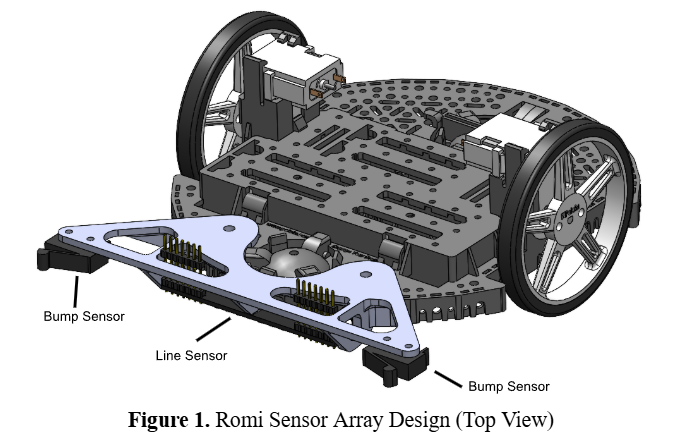

# Romi-Line-Following-Robot
This is a design of a line following robot designed with a STM32 based microcontroller programmed in MicroPython

## Design
### Mechanical Design 

To allow for the optimal placement of the line and bump sensors, a romi-friendly attachment was designed and fabricated using 3d printing. 

For the line sensor, we tested distances and angles with the best resolution and the least amount of noise. The line sensor is at the same distance radially from the robot as the wheels, which allows for a simple proportional yaw controller from the feedback provided by the line sensor. 

The bump sensors are also kept in front of the line sensor and spaced apart, allowing the Romi to “bump” into the wall and straighten itself out before attempting to circumvent it. This also meant that the mount had to be able to take the impact force from collision, requiring structural rigidity.  The detailed drawing is included in Appendix A.

